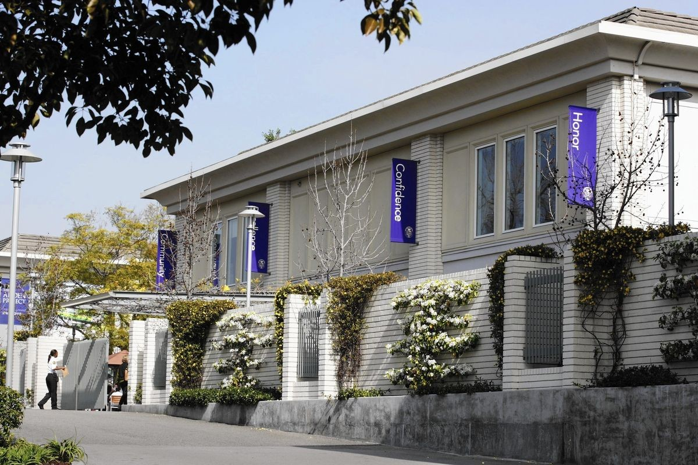
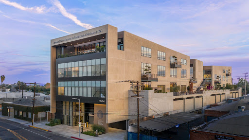
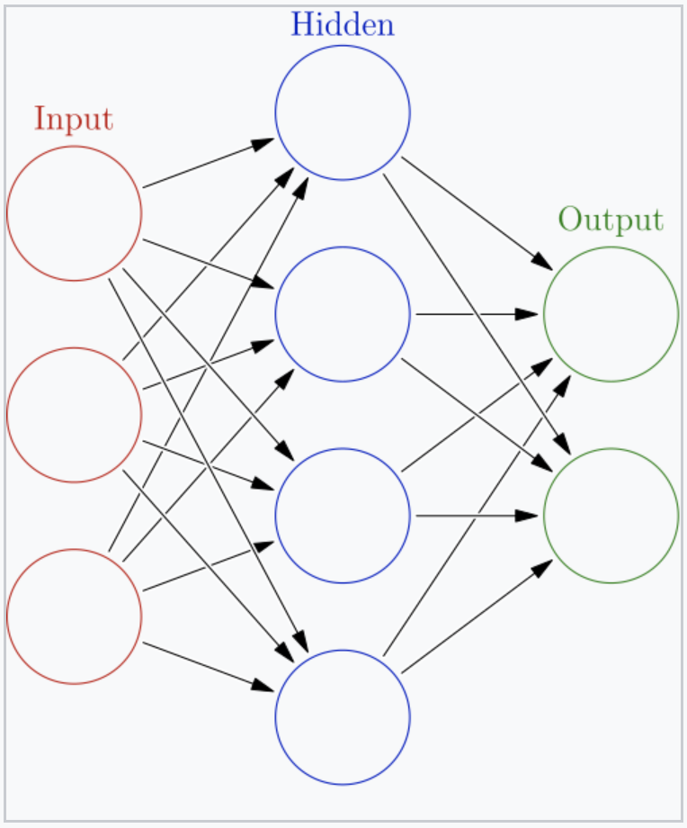
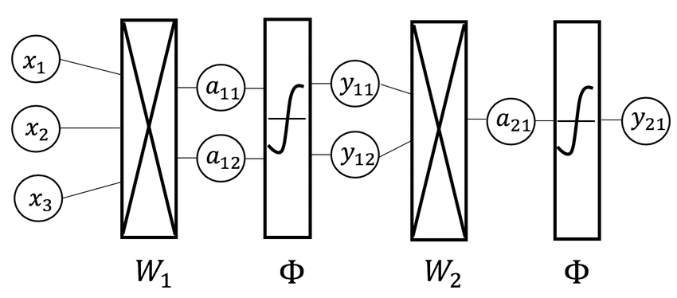
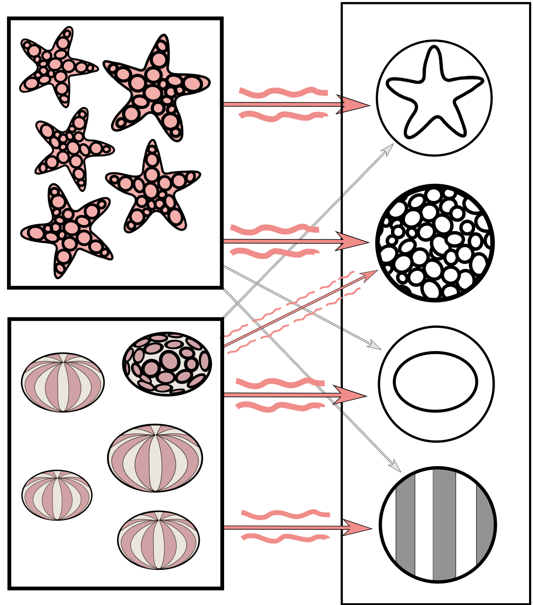
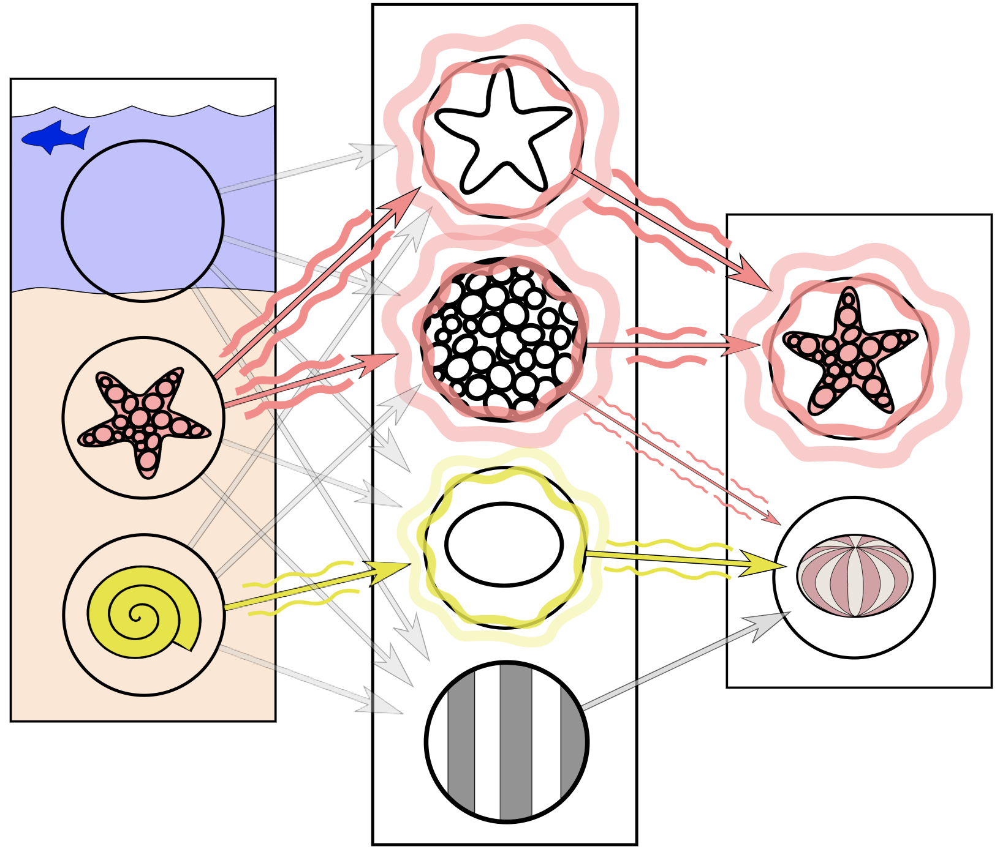
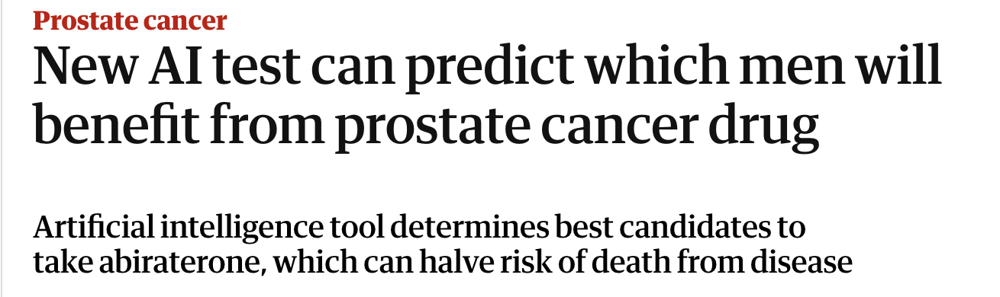

.center[
       

## AI Advances in Science

       

Dr. Darren Kessner  
Marlborough School   
Educator Workshops  
June 3, 2025

   

[dkessner.github.io/educator_workshop_2025](http://dkessner.github.io/educator_workshop_2025)  
]

---

### Who Am I?

.split-50[
.column[
.center[

]
]

.column[
]
.center[
__Dr. Kessner__
]

- BS, MA in Mathematics

- PhD in Bioinformatics

- software developer for over 25 years

.center[
__Marlborough School__
]

- Program Head of Computer Science and Software Innovation

- 11th year

- AP Computer Science and Honors Computer Science Projects

.center[
__Ellison Institute of Technology__  
]

- Senior Software Engineer in AI and Advanced Molecular Medicine group

]

---

### Neural networks

.split-60[

.column[

 
 

 
 
 
<small>
Image credits:
[1](https://commons.wikimedia.org/wiki/File:Neuron3.svg)
[2](https://commons.wikimedia.org/wiki/File:Artificial_neuron_structure.svg)
[3](https://commons.wikimedia.org/wiki/File:Colored_neural_network.svg)
</small>

]

.column[
 

.center[
weights == parameters

training == adjusting weights to decrease loss
]

]

]

 

---

### Neural networks 

.center[

 

__Neural network__   
composition of functions   
(linear transformations / matrix multiplication)

 

__Backpropagation algorithm__  
calculation of gradient   
(chain rule)  

]

<small>
[Image credit](https://www.researchgate.net/figure/Example-of-simple-neural-network-architecture-with-linear-transformation-dense-layer-and_fig2_347965848)
</small>

---

### Computer vision

.split-50[

.column[

.center[__Training__]

 
 
<small>
Image credits:
[1](https://commons.wikimedia.org/wiki/File:Simplified_neural_network_training_example.svg)
[2](https://commons.wikimedia.org/wiki/File:Simplified_neural_network_training_example.svg)
</small>
]

.column[

.center[__Prediction__]
]

]

---

### CV: cancer detection

https://www.theguardian.com/society/2025/may/30/new-ai-test-can-predict-which-men-will-benefit-from-prostate-cancer-drug

---

### CV: face / body detection

example: dance concert

---

### Central Dogma

DNA -> RNA -> protein

---

### Alpha Fold

structure prediction

---

### Drug discovery

+ genAI -> new sequences

+ CRISPR story - child genetic defect, personalized medicine

---

### AI coding assistants

AI agents / aider

---

### Math & Science Concepts

 

- Linear regression

 

- Linear algebra
    - vectors
    - dot product
    - matrix multiplication
    - linear transformations

 

- Calculus 
    - derivatives
    - minimization / maximization of functions
        - Newton's method
    - multivariable functions
        - gradients
    - chain rule

---

### Thank you!

.center[

 
dkessner.github.io/educator_workshop_2025
 

TODO: replace QR code  

 

]

